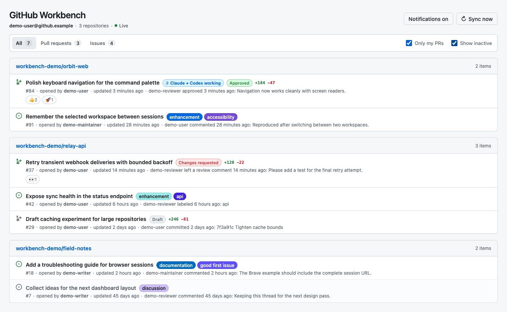
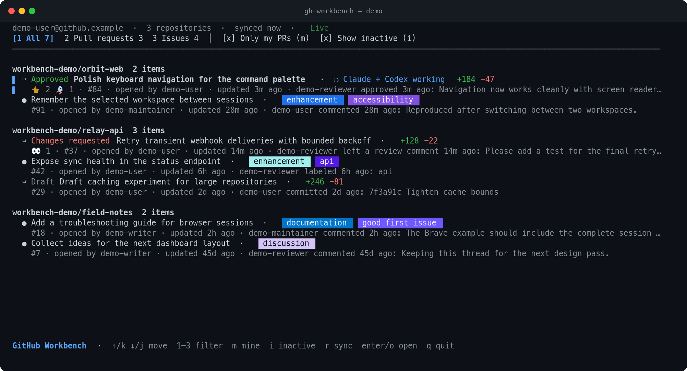

# GitHub Workbench

GitHub Workbench is a local workbench for GitHub issues and pull requests with
browser and terminal interfaces. It runs as a GitHub CLI extension, finds open
work authored by, assigned to, mentioning, reviewed by, or awaiting review from
the active `gh` account across repositories, stores an account-scoped cache in
SQLite, and keeps the selected UI current through adaptive polling.

Browser interface:



Terminal interface:



Both screenshots use the built-in synthetic repositories and work items.

## Install

Requirements:

- A current GitHub CLI release
- An active account stored by `gh auth login` in the operating system's secure
  credential store

```sh
gh auth login
gh extension install zoubingwu/gh-workbench
gh workbench
```

GitHub Workbench starts its terminal interface by default. TUI mode requires
interactive standard input and output. The extension includes the Go service,
SQLite driver, and frontend assets in one platform-specific executable.

Use the browser interface with:

```sh
gh workbench --browser
```

Browser mode starts a loopback service and opens the browser. It also supports
printing the authenticated local URL for manual opening:

```sh
gh workbench --browser --no-open
```

The terminal interface groups work by repository and shows the same account,
sync, filter, pull request, issue, activity, reaction, and polling information
as the browser work list. It accepts these keys:

| Key | Action |
| --- | --- |
| `j`, `down`, `k`, `up` | Move the selection |
| `pgdown`, `pgup` | Move by one visible page |
| `1`, `2`, `3` | Show all items, pull requests, or issues |
| `m` | Toggle the account-scoped “Only my PRs” filter |
| `i` | Toggle inactive items |
| `n` | Toggle macOS system notifications |
| `r` | Sync now |
| `enter`, `o` | Open the selected work item |
| `q`, `ctrl+c` | Exit |

The browser and terminal interfaces can enable account-scoped macOS system
notifications. The Go process delivers informational notifications while it
remains running; browser-mode delivery continues after its tab closes. The
“Only my PRs” setting also controls which pull request activity can produce a
system notification.

Pull request rows show local Codex and Claude Code activity when a running
session's Git checkout matches the pull request head repository, branch, or
commit. Discovery is automatic and read-only, using local metadata with zero
configuration. Codex activity is inferred from lifecycle records. Claude Code
activity uses the live session registry, plus the official session JSON command
while its background supervisor is running.

Upgrade or remove the extension with:

```sh
gh extension upgrade workbench
gh extension remove workbench
```

## Local data and security

GitHub Workbench reads the active account token from the GitHub CLI keyring and
sends API requests directly to the selected GitHub host. Token environment
variables are excluded from credential selection.

In browser mode, the HTTP service listens on a random `127.0.0.1` port and
protects each process with a random session token. TUI mode reads snapshots
directly from the account-scoped SQLite store. SQLite files live under the
operating system's user cache directory in `gh-workbench`. The cache contains
repository, issue, pull request, reaction, review, latest-activity, and
notification preference data. GitHub Workbench sends no telemetry.

Latest activity covers conversation comments, inline review comments and
replies, submitted reviews, pull request commits, label changes, reopen
events, review requests, and ready/draft transitions. Comment edits use their
latest update time. A pull request commit's first observation uses the pull
request update time as the available event clock when that commit is the
newest selected timeline activity, with the Git commit time as a fallback.
SQLite then keeps that clock stable for the commit identity. GitHub has retired
the exact GraphQL push timestamp.

Local coding-agent activity remains ephemeral and is added only to UI
snapshots. The observer reads Codex thread metadata, lifecycle event types, and
explicit tool working-directory fields. Prompt, response, reasoning, command,
and tool-output content stays outside the snapshot and Workbench cache. The
Claude live session registry is read directly. The documented daemon status
command gates the official session JSON query, keeping a stopped supervisor
stopped. `CODEX_HOME` and `CLAUDE_CONFIG_DIR` are respected when set.

On Linux, configure a Secret Service-compatible keyring before running
`gh auth login`.

Removing the extension preserves its cache. Delete the `gh-workbench` directory
under the operating system's user cache directory to clear all local data.

Third-party license and attribution texts are available in
[`THIRD_PARTY_NOTICES.md`](THIRD_PARTY_NOTICES.md) and as a release asset.

## Development

Requirements:

- Go 1.25 or newer
- Node.js 24 or newer
- pnpm 11 or newer
- GitHub CLI authenticated with `gh auth login`

```sh
make install
make check
make dev
```

`make dev` builds the frontend and starts the account workbench from this
checkout. After installation, `gh workbench` starts from any directory. Set
`GH_HOST` when selecting an authenticated GitHub Enterprise host.

For local screenshots, build the frontend once and start either UI with the
built-in synthetic snapshot:

```sh
pnpm --dir web build

# Browser
go run ./cmd/gh-workbench --demo

# Terminal
go run ./cmd/gh-workbench --demo --ui tui
```

Demo mode runs entirely from memory and leaves GitHub credentials, GitHub APIs,
and the SQLite cache untouched.

## Install as a local extension

From this repository:

```sh
make build
gh extension remove workbench 2>/dev/null || true
gh extension install .
gh workbench
```

## Polling model

Account-wide GraphQL searches reconcile those five direct relationships. Each
relevant pull request's reactions remain an independent polling resource so
body reactions stay observable. A changed resource returns to a
ten-second interval. Unchanged resources cool down exponentially, with caps
based on recent GitHub activity: five minutes for the last day, thirty minutes
for the last week, and one day for older open work. HTTP ETags avoid downloading
unchanged reaction payloads. A bounded worker pool and an account-wide
one-request-per-second gate keep the global polling queue controlled. GitHub
rate-limit responses pause the queue until its reset time. Search omissions
leave the visible workbench immediately while the cache keeps them for three
searches, protecting reactions from transient index or pagination gaps. `Sync
now` refreshes both account search and every relevant pull request reaction.
